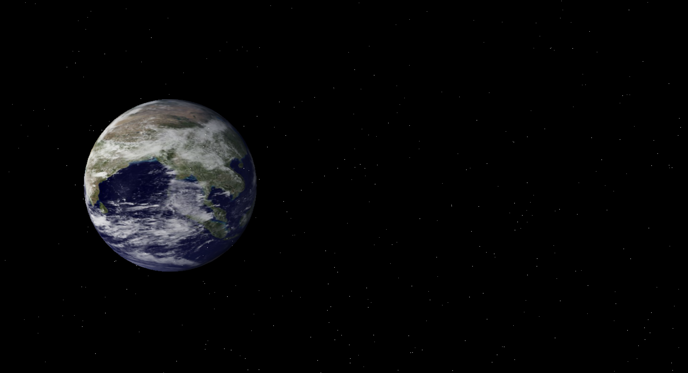

# ThreeJsWorldAnimation

Welcome to the Universe project! This project combines the beauty of a starry sky with a 3D-rendered Earth using Three.js.

## Description

The Universe project creates a stunning visual representation of space by generating a field of stars against a backdrop of a rotating Earth. It utilizes HTML, CSS, and JavaScript, along with the Three.js library for 3D rendering.

## Preview



## Installation

To run this project locally, follow these steps:

1. Clone the repository to your local machine:

```bash
git clone https://github.com/isinsuatay/universe-project.git
```

2. Navigate to the project directory:

```bash
cd universe-project
```


3. Open the `index.html` file in your web browser.

## Usage

Once the project is running, you'll see a field of stars twinkling against the backdrop of Earth. The Earth rotates slowly, providing a mesmerizing effect.

## Credits

- [Three.js](https://threejs.org/) - A JavaScript 3D library.
- [Wikimedia Commons](https://commons.wikimedia.org/wiki/Main_Page) - Source of Earth texture image.


